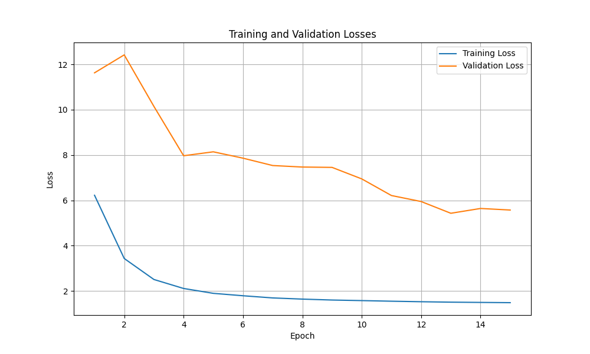

NRMS bert, no ff. Frozen = False. 
Metrics: {'auc': 0.5, 'mrr': 0.31349529729359427, 'ndcg@5': 0.34556800040076646, 'ndcg@10': 0.43028708585700537} 

no ff. Frozen = true.
Metrics: {'auc': 0.5554046379128829, 'mrr': 0.35934305708449976, 'ndcg@5': 0.39768044974567907, 'ndcg@10': 0.4719018445527051}

DOCVEC (LSTM) 0.1
Metrics: {'auc': 0.6029470368985131, 'mrr': 0.38295913539324095, 'ndcg@5': 0.42784959939065814, 'ndcg@10': 0.49890685681915986}

DOCVEC (multi head self attention) 0.1
Metrics: {'auc': 0.6026206272070231, 'mrr': 0.3832181074207851, 'ndcg@5': 0.42921075012394216, 'ndcg@10': 0.49943171461324926}

DOC vec (all features concat in into ff layers )
Mean AUC: 0.6121

Doc vec (numeric and categorical features)
Mean AUC: 0.6109

Best trial:
  Value:  3.823757140259994
  Params: 
    head_num: 32
    shared_dim: 124
    dropout: 0.161789721292941
    learning_rate: 1.2747073900306542e-05
    weight_decay: 0.002739999228286127
    unit_layer_1: 315
    unit_layer_2: 500
    use_category: False
    use_topic: True
    use_numeric: False
    use_publication_discount: False
    use_session_discount: False

FeatureFusion: Modified to apply the activation function (Sigmoid) to the output of the gate (gate(feature)), ensuring both tensors have the same shape before multiplication.
Flatten Features: Before passing features to FeatureFusion, each feature is flattened to shape [batch_size * num_titles, dim].
Layer Normalization: Applied after feature fusion and before reshaping back to [batch_size, num_titles, -1].
NumericEncoder: Redesigned with additional layers for better representation learning.
Time Discount Mechanism: Implemented as a learnable function with the TimeDiscount class, applied in both NewsEncoderDocVec and UserEncoderDocVec.

    